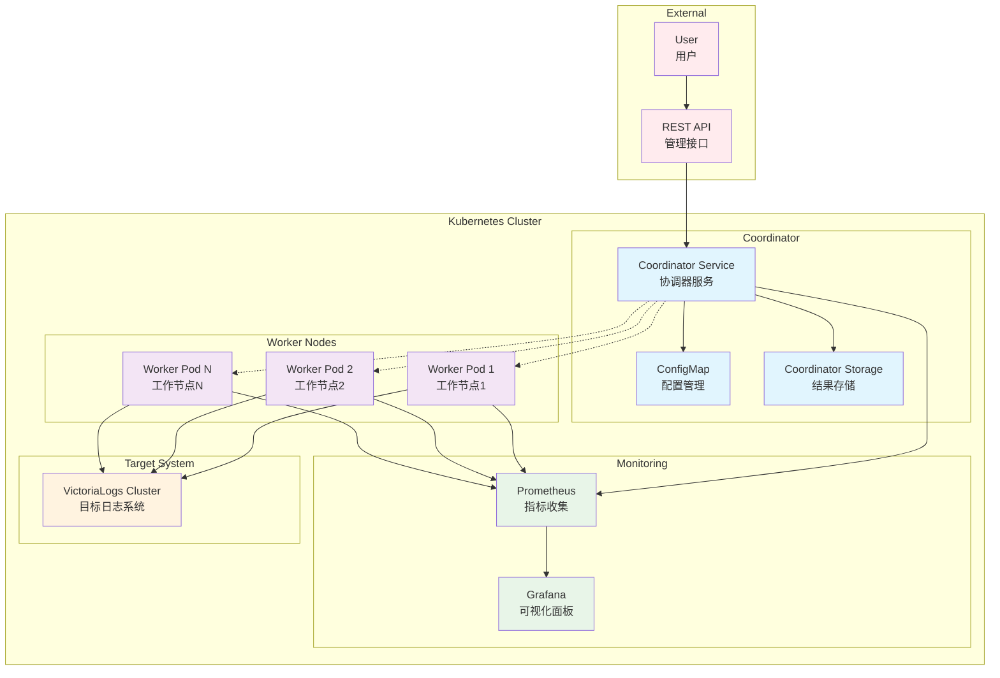

# 分布式 VictoriaLogs 性能压测系统设计文档

## 概述

本文档描述了分布式 VictoriaLogs LogsQL 查询性能压测系统的详细设计。该系统采用主从架构，通过协调器统一管理多个工作节点，实现大规模并发查询压测，突破单节点资源限制。

## 架构设计

### 系统架构图



### 组件架构

#### 1. 协调器服务 (Coordinator Service)

**职责:**
- 管理工作节点的注册和心跳
- 分配和调度压测任务
- 聚合和分析压测结果
- 提供 REST API 接口
- 监控整体压测状态

**核心模块:**
```go
type CoordinatorService struct {
    NodeManager      *NodeManager      // 节点管理器
    TaskScheduler    *TaskScheduler    // 任务调度器
    ResultAggregator *ResultAggregator // 结果聚合器
    APIServer        *gin.Engine       // API 服务器
    ConfigManager    *ConfigManager    // 配置管理器
    HealthChecker    *HealthChecker    // 健康检查器
}
```

#### 2. 工作节点 (Worker Node)

**职责:**
- 向协调器注册并维持心跳
- 接收并执行压测任务
- 收集性能指标数据
- 上报执行状态和结果

**核心模块:**
```go
type WorkerNode struct {
    NodeRegistrar    *NodeRegistrar    // 节点注册器
    TaskExecutor     *TaskExecutor     // 任务执行器
    QueryEngine      *QueryEngine      // 查询引擎
    MetricsCollector *MetricsCollector // 指标收集器
    ResultReporter   *ResultReporter   // 结果上报器
}
```

## 详细设计

### 1. 通信协议设计

#### 节点注册协议
```json
{
  "action": "register",
  "node_id": "worker-001",
  "capabilities": {
    "max_concurrent_queries": 100,
    "supported_query_types": ["basic", "stats", "regex"],
    "resources": {
      "cpu_cores": 4,
      "memory_mb": 8192
    }
  },
  "endpoint": "http://worker-001:8080"
}
```

#### 任务分配协议
```json
{
  "task_id": "benchmark-001",
  "node_assignments": {
    "worker-001": {
      "concurrent_users": 25,
      "duration": 300,
      "query_templates": ["basic_filter", "json_field"],
      "target_qps": 50
    }
  },
  "global_config": {
    "target_url": "http://vlselect:8481",
    "auth": {"type": "bearer", "token": "xxx"}
  }
}
```

#### 结果上报协议
```json
{
  "task_id": "benchmark-001",
  "node_id": "worker-001",
  "timestamp": "2025-07-17T10:00:00Z",
  "metrics": {
    "total_queries": 1500,
    "successful_queries": 1485,
    "failed_queries": 15,
    "avg_response_time": 125.5,
    "p95_response_time": 280.2,
    "qps": 49.8
  },
  "status": "completed"
}
```

### 2. 数据模型设计

#### 压测配置模型
```yaml
apiVersion: benchmark.victorialogs.io/v1
kind: BenchmarkConfig
metadata:
  name: distributed-logsql-benchmark
spec:
  target:
    url: "http://vlselect.monitoring.svc.cluster.local:8481"
    auth:
      type: "bearer"
      token: "your-token"
  
  workload:
    total_concurrent_users: 200
    duration: 600  # seconds
    ramp_up_time: 60  # seconds
    
  queries:
    - name: "basic_filter"
      template: 'job:"loki.source.kubernetes.pods"'
      weight: 20
      category: "filter"
    
    - name: "error_requests"
      template: '_msg:*"status":5* OR _msg:*"status":4*'
      weight: 15
      category: "complex"
  
  workers:
    replicas: 5
    resources:
      requests:
        cpu: "500m"
        memory: "1Gi"
      limits:
        cpu: "2"
        memory: "4Gi"
  
  reporting:
    formats: ["json", "csv", "prometheus"]
    storage:
      type: "persistent_volume"
      path: "/results"
```

#### 节点状态模型
```go
type NodeStatus struct {
    NodeID             string                 `json:"node_id"`
    Status             string                 `json:"status"` // "active", "busy", "failed", "offline"
    LastHeartbeat      time.Time              `json:"last_heartbeat"`
    CurrentLoad        float64                `json:"current_load"` // 0.0 - 1.0
    Capabilities       map[string]interface{} `json:"capabilities"`
    AssignedTasks      []string               `json:"assigned_tasks"`
    PerformanceMetrics map[string]float64     `json:"performance_metrics"`
}
```

#### 任务执行模型
```go
type TaskExecution struct {
    TaskID       string                 `json:"task_id"`
    NodeID       string                 `json:"node_id"`
    Status       string                 `json:"status"` // "pending", "running", "completed", "failed"
    StartTime    time.Time              `json:"start_time"`
    EndTime      *time.Time             `json:"end_time,omitempty"`
    Config       map[string]interface{} `json:"config"`
    Results      map[string]interface{} `json:"results,omitempty"`
    ErrorMessage string                 `json:"error_message,omitempty"`
}
```

### 3. 负载均衡算法

#### 加权轮询算法
```go
type WeightedRoundRobinScheduler struct {
    nodes          map[string]int // 节点权重
    currentWeights map[string]int // 当前权重
    mutex          sync.RWMutex
}

func NewWeightedRoundRobinScheduler() *WeightedRoundRobinScheduler {
    return &WeightedRoundRobinScheduler{
        nodes:          make(map[string]int),
        currentWeights: make(map[string]int),
    }
}

func (w *WeightedRoundRobinScheduler) AddNode(nodeID string, weight int) {
    w.mutex.Lock()
    defer w.mutex.Unlock()
    
    // 基于节点资源能力设置权重
    w.nodes[nodeID] = weight
    w.currentWeights[nodeID] = 0
}

func (w *WeightedRoundRobinScheduler) SelectNode() string {
    w.mutex.Lock()
    defer w.mutex.Unlock()
    
    if len(w.nodes) == 0 {
        return ""
    }
    
    // 更新当前权重
    for nodeID := range w.nodes {
        w.currentWeights[nodeID] += w.nodes[nodeID]
    }
    
    // 选择权重最高的节点
    var selectedNode string
    maxWeight := math.MinInt32
    for nodeID, weight := range w.currentWeights {
        if weight > maxWeight {
            maxWeight = weight
            selectedNode = nodeID
        }
    }
    
    // 减少选中节点的权重
    totalWeight := 0
    for _, weight := range w.nodes {
        totalWeight += weight
    }
    w.currentWeights[selectedNode] -= totalWeight
    
    return selectedNode
}
```

#### 动态负载调整
```go
type DynamicLoadBalancer struct {
    scheduler *WeightedRoundRobinScheduler
    mutex     sync.RWMutex
}

func (d *DynamicLoadBalancer) AdjustLoad(nodeMetrics map[string]*NodeMetrics) {
    d.mutex.Lock()
    defer d.mutex.Unlock()
    
    // 根据节点性能动态调整负载
    for nodeID, metrics := range nodeMetrics {
        switch {
        case metrics.AvgResponseTime > 1000: // 1秒
            d.reduceNodeWeight(nodeID, 0.8)
        case metrics.ErrorRate > 0.05: // 5%
            d.reduceNodeWeight(nodeID, 0.9)
        default:
            d.restoreNodeWeight(nodeID)
        }
    }
}

type NodeMetrics struct {
    AvgResponseTime float64 `json:"avg_response_time"`
    ErrorRate       float64 `json:"error_rate"`
    QPS             float64 `json:"qps"`
}
```

### 4. 结果聚合设计

#### 实时聚合器
```go
type MetricData struct {
    NodeID  string                 `json:"node_id"`
    Metrics map[string]interface{} `json:"metrics"`
}

type RealTimeAggregator struct {
    metricsBuffer     map[int64][]MetricData
    aggregationWindow int64 // seconds
    mutex             sync.RWMutex
}

func NewRealTimeAggregator() *RealTimeAggregator {
    return &RealTimeAggregator{
        metricsBuffer:     make(map[int64][]MetricData),
        aggregationWindow: 10, // seconds
    }
}

func (r *RealTimeAggregator) AddMetrics(nodeID string, metrics map[string]interface{}) {
    r.mutex.Lock()
    defer r.mutex.Unlock()
    
    // 添加节点指标
    timestamp := time.Now().Unix()
    r.metricsBuffer[timestamp] = append(r.metricsBuffer[timestamp], MetricData{
        NodeID:  nodeID,
        Metrics: metrics,
    })
    
    // 清理过期数据
    r.cleanupOldMetrics(timestamp)
}

func (r *RealTimeAggregator) GetGlobalMetrics() map[string]interface{} {
    r.mutex.RLock()
    defer r.mutex.RUnlock()
    
    // 计算全局聚合指标
    var allMetrics []MetricData
    for _, timestampMetrics := range r.metricsBuffer {
        allMetrics = append(allMetrics, timestampMetrics...)
    }
    
    totalQPS := 0.0
    var responseTimes []float64
    activeNodes := make(map[string]bool)
    
    for _, m := range allMetrics {
        if qps, ok := m.Metrics["qps"].(float64); ok {
            totalQPS += qps
        }
        if rt, ok := m.Metrics["avg_response_time"].(float64); ok {
            responseTimes = append(responseTimes, rt)
        }
        activeNodes[m.NodeID] = true
    }
    
    avgResponseTime := 0.0
    if len(responseTimes) > 0 {
        sum := 0.0
        for _, rt := range responseTimes {
            sum += rt
        }
        avgResponseTime = sum / float64(len(responseTimes))
    }
    
    return map[string]interface{}{
        "total_qps":         totalQPS,
        "avg_response_time": avgResponseTime,
        "global_error_rate": r.calculateErrorRate(allMetrics),
        "active_nodes":      len(activeNodes),
    }
}

func (r *RealTimeAggregator) cleanupOldMetrics(currentTimestamp int64) {
    cutoff := currentTimestamp - r.aggregationWindow
    for timestamp := range r.metricsBuffer {
        if timestamp < cutoff {
            delete(r.metricsBuffer, timestamp)
        }
    }
}
```

### 5. 容错和恢复机制

#### 节点故障检测
```go
type FailureDetector struct {
    heartbeatTimeout time.Duration
    nodeLastSeen     map[string]time.Time
    mutex            sync.RWMutex
}

func NewFailureDetector(heartbeatTimeout time.Duration) *FailureDetector {
    return &FailureDetector{
        heartbeatTimeout: heartbeatTimeout,
        nodeLastSeen:     make(map[string]time.Time),
    }
}

func (f *FailureDetector) UpdateHeartbeat(nodeID string) {
    f.mutex.Lock()
    defer f.mutex.Unlock()
    
    f.nodeLastSeen[nodeID] = time.Now()
}

func (f *FailureDetector) GetFailedNodes() []string {
    f.mutex.RLock()
    defer f.mutex.RUnlock()
    
    currentTime := time.Now()
    var failedNodes []string
    
    for nodeID, lastSeen := range f.nodeLastSeen {
        if currentTime.Sub(lastSeen) > f.heartbeatTimeout {
            failedNodes = append(failedNodes, nodeID)
        }
    }
    
    return failedNodes
}
```

#### 任务重分配
```go
type TaskRebalancer struct {
    scheduler *WeightedRoundRobinScheduler
    logger    *logrus.Logger
    mutex     sync.RWMutex
}

func (t *TaskRebalancer) HandleNodeFailure(failedNode string, activeNodes []string) error {
    t.mutex.Lock()
    defer t.mutex.Unlock()
    
    // 处理节点故障，重新分配任务
    failedTasks := t.getTasksByNode(failedNode)
    
    if len(activeNodes) == 0 {
        t.logger.Error("No active nodes available for task rebalancing")
        return fmt.Errorf("no active nodes available")
    }
    
    // 将失败节点的任务重新分配给活跃节点
    for _, task := range failedTasks {
        targetNode := t.scheduler.SelectNode()
        if err := t.reassignTask(task, targetNode); err != nil {
            t.logger.WithError(err).Errorf("Failed to reassign task %s", task.TaskID)
            continue
        }
        t.logger.Infof("Reassigned task %s to node %s", task.TaskID, targetNode)
    }
    
    return nil
}

func (t *TaskRebalancer) getTasksByNode(nodeID string) []*TaskExecution {
    // 实现获取指定节点的任务列表
    // 这里需要根据实际的任务存储实现
    return nil
}

func (t *TaskRebalancer) reassignTask(task *TaskExecution, targetNode string) error {
    // 实现任务重新分配逻辑
    task.NodeID = targetNode
    task.Status = "pending"
    return nil
}
```

### 6. 监控和可观测性

#### Prometheus 指标定义
```go
import (
    "github.com/prometheus/client_golang/prometheus"
    "github.com/prometheus/client_golang/prometheus/promauto"
)

var (
    // 协调器指标
    coordinatorActiveNodes = promauto.NewGauge(prometheus.GaugeOpts{
        Name: "coordinator_active_nodes_total",
        Help: "Number of active worker nodes",
    })
    
    coordinatorTotalQPS = promauto.NewGauge(prometheus.GaugeOpts{
        Name: "coordinator_total_qps",
        Help: "Total queries per second across all nodes",
    })
    
    coordinatorTaskDuration = promauto.NewHistogram(prometheus.HistogramOpts{
        Name: "coordinator_task_duration_seconds",
        Help: "Task execution duration",
    })
    
    // 工作节点指标
    workerQueryDuration = promauto.NewHistogramVec(prometheus.HistogramOpts{
        Name: "worker_query_duration_seconds",
        Help: "Query execution duration",
    }, []string{"node_id", "query_type"})
    
    workerQueryErrors = promauto.NewCounterVec(prometheus.CounterOpts{
        Name: "worker_query_errors_total",
        Help: "Total query errors",
    }, []string{"node_id", "error_type"})
    
    workerActiveConnections = promauto.NewGaugeVec(prometheus.GaugeOpts{
        Name: "worker_active_connections",
        Help: "Number of active connections to VictoriaLogs",
    }, []string{"node_id"})
)
```

#### 健康检查端点
```go
import (
    "net/http"
    "time"
    "github.com/gin-gonic/gin"
    "github.com/prometheus/client_golang/prometheus/promhttp"
)

type HealthResponse struct {
    Status      string    `json:"status"`
    Timestamp   time.Time `json:"timestamp"`
    Version     string    `json:"version"`
    ActiveNodes int       `json:"active_nodes"`
    RunningTasks int      `json:"running_tasks"`
}

func (c *CoordinatorService) setupRoutes() {
    c.APIServer.GET("/health", c.healthCheck)
    c.APIServer.GET("/metrics", gin.WrapH(promhttp.Handler()))
}

func (c *CoordinatorService) healthCheck(ctx *gin.Context) {
    response := HealthResponse{
        Status:       "healthy",
        Timestamp:    time.Now(),
        Version:      VERSION,
        ActiveNodes:  len(c.NodeManager.GetActiveNodes()),
        RunningTasks: len(c.TaskScheduler.GetRunningTasks()),
    }
    
    ctx.JSON(http.StatusOK, response)
}
```

## 部署架构

### Kubernetes 部署清单

#### 协调器部署
```yaml
apiVersion: apps/v1
kind: Deployment
metadata:
  name: benchmark-coordinator
spec:
  replicas: 1
  selector:
    matchLabels:
      app: benchmark-coordinator
  template:
    metadata:
      labels:
        app: benchmark-coordinator
      annotations:
        prometheus.io/scrape: "true"
        prometheus.io/port: "8080"
    spec:
      containers:
      - name: coordinator
        image: victorialogs-benchmark-coordinator:latest
        ports:
        - containerPort: 8080
          name: http
        - containerPort: 8090
          name: grpc
        env:
        - name: COORDINATOR_MODE
          value: "true"
        - name: REDIS_URL
          value: "redis://redis:6379"
        resources:
          requests:
            cpu: 500m
            memory: 1Gi
          limits:
            cpu: 2
            memory: 4Gi
```

#### 工作节点部署
```yaml
apiVersion: apps/v1
kind: Deployment
metadata:
  name: benchmark-workers
spec:
  replicas: 5
  selector:
    matchLabels:
      app: benchmark-worker
  template:
    metadata:
      labels:
        app: benchmark-worker
      annotations:
        prometheus.io/scrape: "true"
        prometheus.io/port: "8080"
    spec:
      containers:
      - name: worker
        image: victorialogs-benchmark-worker:latest
        ports:
        - containerPort: 8080
          name: metrics
        env:
        - name: COORDINATOR_URL
          value: "http://benchmark-coordinator:8080"
        - name: NODE_ID
          valueFrom:
            fieldRef:
              fieldPath: metadata.name
        resources:
          requests:
            cpu: 500m
            memory: 1Gi
          limits:
            cpu: 2
            memory: 4Gi
```

### 扩展性设计

#### 水平扩展
- 工作节点支持通过 Kubernetes HPA 自动扩缩容
- 协调器支持多实例部署（主备模式）
- 使用 Redis 作为共享状态存储

#### 垂直扩展
- 支持根据目标系统规模调整单节点资源配置
- 动态调整并发数和查询频率
- 支持不同规格的工作节点混合部署

## 安全设计

### 通信安全
- 所有组件间通信使用 TLS 1.3 加密
- 支持 mTLS 双向认证
- API 访问需要 JWT Token 认证

### 权限控制
```yaml
apiVersion: rbac.authorization.k8s.io/v1
kind: ClusterRole
metadata:
  name: benchmark-coordinator
rules:
- apiGroups: [""]
  resources: ["pods", "services", "configmaps"]
  verbs: ["get", "list", "watch", "create", "update", "patch"]
- apiGroups: ["apps"]
  resources: ["deployments"]
  verbs: ["get", "list", "watch", "update", "patch"]
```

### 数据保护
- 敏感配置信息存储在 Kubernetes Secret 中
- 压测结果支持加密存储
- 支持数据脱敏和匿名化处理

## 性能优化

### 连接池管理
```go
import (
    "net/http"
    "time"
    "crypto/tls"
)

type ConnectionPoolManager struct {
    client    *http.Client
    targetURL string
    poolSize  int
}

func NewConnectionPoolManager(targetURL string, poolSize int) *ConnectionPoolManager {
    transport := &http.Transport{
        MaxIdleConns:        poolSize,
        MaxIdleConnsPerHost: poolSize / 2,
        IdleConnTimeout:     30 * time.Second,
        DisableCompression:  false,
        TLSClientConfig: &tls.Config{
            InsecureSkipVerify: false,
        },
        // 启用 HTTP/2
        ForceAttemptHTTP2: true,
    }
    
    client := &http.Client{
        Transport: transport,
        Timeout:   30 * time.Second,
    }
    
    return &ConnectionPoolManager{
        client:    client,
        targetURL: targetURL,
        poolSize:  poolSize,
    }
}

func (c *ConnectionPoolManager) GetClient() *http.Client {
    return c.client
}

func (c *ConnectionPoolManager) Close() {
    if transport, ok := c.client.Transport.(*http.Transport); ok {
        transport.CloseIdleConnections()
    }
}
```

### 内存优化
- 使用流式处理大量结果数据
- 实现结果数据的分批上报机制
- 定期清理过期的指标数据

### 网络优化
- 使用 HTTP/2 协议提高连接复用
- 实现请求批处理减少网络开销
- 支持数据压缩传输

## 测试策略

### 单元测试
- 核心算法和数据结构测试
- 模拟各种故障场景测试
- 性能关键路径测试

### 集成测试
- 组件间通信协议测试
- 端到端压测流程测试
- 故障恢复机制测试

### 性能测试
- 系统自身的性能基准测试
- 不同规模下的扩展性测试
- 长时间运行的稳定性测试